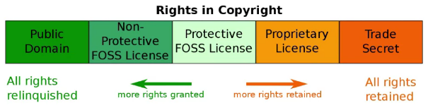
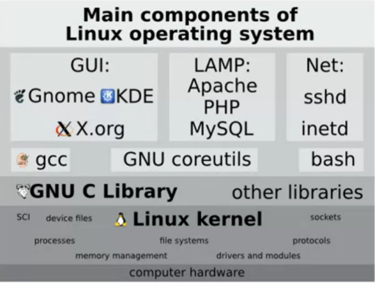

# Open Source Software Development, Linux and Git
##### by The Linux Foundation

## Curso 1: Open Source Software Development
##### Professor: Jerry Cooperstein

##### Nesse curso, veremos o que é software livre, passando pela sua história e boas práticas.

### Anotações

- *Software Livre* quer dizer **não limitado/controlado**, **livre de custos/pagamentos**

- Esse conceito de livre levou a criação do termo *Open Source*

- Então, dentro desse mundo *Open Source*, os usuários tem acesso ao **Código Fonte**,
sendo ele mediante uma **Licença**, que garante 3 coisas:
    - examinar
    - modificar
    - redistribuir
    
    tudo isso de acordo com a licença vigente

- Falando de *Licenças*, elas podem ser:
    - Permissivas
    
        Preferida pelas companhias, essa licença permite que: caso alguma mudança seja feita
        no código fonte, vc não precisa liberar o acesso aos outros à esse código. Exemplo
        disso são as licenças tipo BSD-license software
    
    - Restritivas
        
        Essa garante que você tem acesso ao meu código fonte, pode modificá-lo e usá-lo como
        queira, porém deve manter a mesma liberdade para outros que desejam ver e modificar
        seu código. Como se fosse um efeito cascata. Exemplo de licenças assim são as GPL-license
        software

- **Software Proprietário** é definido porque quem detém os direitos do produto, não necessáriamente
quem escreveu os códigos. Ou seja, somente quem é o dono tem acesso aos códigos fonte. Essa prática era
a mais difundida até a chegada da OSS.

- Caso uma empresa que funcione dessa maneira queira fazer parcerias, ela pode garantir acesso aos códigos
fonte através de um **Acordo de Não-Divulgação** (NDA).

- Caso você use um *software proprietário*, você deverá assinar um contrato, ou apertar um botão "Aceito os
termos de uso kkk". Nesse contrato, você verá cláusulas que restringem redistribuição, modificação ou reuso
do código fonte em outros projetos, até umas que eximem o proprietário de qualquer dano/problema, geralmente
por mal uso. É possível encontrar até restrições de como usar o produto.

- Falando das duas modalidades de software, uma coisa que sintetiza bem a diferença entre elas é que **preço
não é caso**. Softwares privados podem ser até mais baratos que os OSS. A diferença entre essas duas
modalidades está na **licença**, ela que diz se pode modificar, redistribuir, reusar o código fonte...

- Existem diversas maneiras de abordar softwares livres, mas as duas mais relevantes são a abordagem 
**Pragmática** e a **Idealista**.

    - Pragmática
    
        As considerações primárias são **Técnicas**. Leva-se em consideração velocidade e facilidade de *debugging*.
        Isso permite mais *reviews*, mais contribuintes no software, melhor desenvolvimento do mesmo.    
    
    - Idealista
        
        As considerações primárias são as razões **Ideológicas** e **Éticas** do software, mais do que as razões técnicas
        unicamente.

- Saber qual é a melhor abordagem para o tipo de produto é muito importante, pois definir bem isso pode diminuir muitos
dos possíveis conflitos.
    
    - um software que mantém um dispositivo médico deve ser secreto?
    
    - um software de sistema de votação deve ser livre?
    
    Responder bem esses paradigmas é uma das primeiras coisas a se fazer quando queremos criar um software.

- **Modelos de Governança de OSS** diz respeito à organização do projeto para que se atinja seu objetivo, como decições
são tomadas e quem as faz. Um projeto ainda é OSS caso:

    - Várias pessoas ou um pequeno grupo contribui à ele
    
    - As decisões tomadas são feitas de forma democrática, ou por uma autoridade
    
    - Planos e discussões são tornadas públicas **antes** do lançamento

- Dentro desses modelos, vale destacar alguns:
    
    - *Company-led*
    
        A produção, manutenção e distribuição de um software é feita por uma entidade
        
        Contribuições externas podem, ou não, serem solicitadas
        
        Datas de planos e lançamentos podem não ser descritos abertamente
        
        Discussões internas podem não ser reveladas
        
        Exemplos: Google Android, Red Hat Enterprise Linux
    
    - *Benevolent Dictatorship (Líder Forte)*
    
        Um indivíduo possui influência sobre outros (bom sentido)
        
        O sucesso e a qualidade de um projeto dependem fortemente da sabedoria e capacidade de gerência do *ditador*
        
        Os propósitos do *ditador* podem ser **políticos**, **sociais**, não somente **estruturais**
        
        Mantenedores escrevem menos e menos código à medida que o projeto vai maturando
        
        Essa forma de governança pode evitar discussões sem fim e levar a um passo mais acelerado de desenvolvimento
        
        Exemplos: Linux kernel, Wikipedia
    
    - *Governing Board (Maior controle por pequenos grupos)*
    
        Um corpo de pessoas carrega para um campo aberto e todas decições são tomadas coletivamente
        
        Decisões de quem pode contribuir, quais softwares novos podem ser encorporados, são feitas pelo **corpo governamental**
        
        lançamento de versões são menos frequentes, mas muito bem *debugged*
        
        Exemplos: FreeBSD, Debian
    
- **Vantagens de usar e lançar produtos OSS**

    - Desenvolvimento Colaborativo
    
        Propicia a produção de melhores softwares
        
        Quando o progresso é compartilhado, nem todo mundo precisa resolver os mesmos problemas e cometer os mesmos erros, 
        o progresso é acelerado e com custos reduzidos
        
        Ter mais pessoas produzindo os códigos gera mais testes e propicia códigos mais robustos e seguros
        
        É difícil para os competidores assimilarem essa cultura colaborativa. Então, passar a ter uma postura de *cowork* 
        pode gerar benefícios maiores que os custos
        
    - Segurança e Qualidade do Código Fonte
    
        Os Padrões dos códigos e estilo tendem a ser mais *limpos* e consistentes quando produzidos em comunidade. Isso 
        porque a própria comunidade exige isso, uma vez que, para que outros possam contribuir com seu projeto, seus 
        códigos devem ser compreensíveis
        
        Existirão mais pessoas trabalhando nos códigos procurando por fraquezas de segurança
        
        Com mais pessoas, existirão mais *inputs* na criação de um projeto. Isso ajuda a evitar más idéias
        
        Potencialmente rápida a solução de problemas

- Os **Usuários** ganham muito em flexibilidade: podem misturar e juntar projetos de diferentes fontes, sem entraves de lincenças.
Podem economizar dinheiro na compra ou aluguel de softwares. Podem "olhar embaixo do capô" e aprender, modificar o código fonte

- No âmbito **Empresarial**, o desenvolvimento colaborativo permite a redução dos custos totais de desenvolvimento, agiliza 
o tempo para lançar um produto ao mercado, encoraja devolutivas da comunidade. Além disso tudo, propicia o reuso de códigos 
para novos produtos

- Ainda nesse âmbito, mas agora olhando pela visão do mercado, OSS propiciam mais confiança, já que os códigos são abertos.

- **Educacionalmente**, os benefícios são imensos: ou os produtos são grátis, ou muito baratos. O leque de áreas disponíveis 
é muito diverso. Os estudantes não ficam engessados nos produtos que usam. E mais importante, incita a criatividade 
dos alunos.

- Para **Desenvolvedores**, as vantágens do OSS também são grandes: trabalhar com OSS facilita a não reinventar as coisas, 
ajuda a tomar boas decisões precocemente no desenvolvimento de produtos. Como OSS possui uma comunidade forte, propicia 
a troca de informações/sugestões. Além de ajudar na procura de novos empregos, pois seu código fonte está aí aberto para 
fácil análise.

- **Projetos OSS de sucesso**
    
    - Linux kernel
        
        OSS desde 1991 graças aos esforços de Linus Torvalds. Representa a base de quase todo mundo de infra
    
    - Git
        
        Sistema VCS criado em 2005 por Linus Torvalds. Como os VCS da época era muito ruins, ele resolveu criar um OS muito
        mais simples e poderoso, o que propiciou lidar com a crescente necessidade de coordenar o trabalho de várias pessoas
        num mesmo projeto
        
    - Apache
        
        O serviço web mais utilizado no mundo (50% da fatia do mercado) desde sua fundação em 1995
    
    - Python, Perl, Ruby
    
    - Tex(1978) e LaTex
        
        Editores de texto que matemáticos amam
    
    - GNU
        
        O Projeto começou em 1983 e oferece muitos dos ingredientes fundamentais de toda tecnologia moderna de computadores,
        tudo no âmbito das suas licenças GPL. gcc, gbd, glibc, bash, coreutils são alguns produtos que surgiram do guardachuva
        da GNU

- **Integração Contínua** veio para solucinar um problema recorrente quando se tratava de um projeto em grupo com muitas
pessoas: era difícil coordenar várias pessoas mandando suas partes para o projeto. Os projetos eram feitos por pequenos grupos,
todos na mesma localidade. E era preciso ter desenvolvedores responsáveis de cuidar do repositório master. Um **Sistema de Controle 
Correção/Revisão** fez-se necessário para acomodar os vários devs no mesmo projeto. Posteriormente, veio o **Git**. Mas só um *VCS*
não é capaz de garantir que tudo está funcionando bem, tem que **testar** o que os contribuidores mandam, e para tal, esses
testes seguem algumas regrinhas:
    
    - É possível sobrepor conjuntos de mudanças simultaneamente sem gerar conflitos?
    
    - O programa funciona depois das mudanças serem aplicadas?
    
    - Funciona em todos os possíveis alvos/objetivos?
    
    - O que significa *o código está funcionando*?
    
    - Existem conjuntos de testes representativos que validem os resuldados do programa?
    
- As técnicas de integração contínua garantem tanto o *VCS* quanto os teste frequentes. Isso permite que erros não durem
muito tempo, e os devs conseguem se manter ao mesmo passo.

- A integração contínua pode ser dividida em **três** estágios:
    
    - **Integração Contínua**: mudanças são fundidas no ramo **master** o quão frequente quanto e conflitos são resolvidos 
    o mais cedo possível
    
    - **Entrega Contínua**: o processo de lançamento é automatizado. Desde que o projeto passe no teste, ele estará pronto
    para os consumidores
    
    - **Implementação Contínua**: o lançamento do projeto propriamente dito

- Falando de **Custos** e **Benefícios**:
    
    - **Custos**
        
        As mudanças devem ser fundidas ao ramo master muito frequentemente, o que gera tensão nos devs
        
        O repositório deve ser monitorado constantemente
        
        Testes automatizados devem ser criados, e isso é trabalhoso
    
    - **Benefícios**
        
        Devs não entram uns no caminho dos outros
        
        As etapas de *build* são automatizadas
        
        Erros que *quebram* a aplicação são minimizados, e os lançamentos apresentam poucos deles

- Os softwares de integração contínua mais usados são: Jenkins, GitLab CI, CircleCI

- Falando aprofundadamente sobre **Licenças** e **Problemas Legais** num projeto OSS, vimos que existem dois tipos de licenças:
as **Permissivas** e **Restritivas**, sendo a primeira usada em projetos proprietários e a segunda a que garante liberdade
de modificação graças ao código aberto.

- Quando queremos propor um software, devemos escolher bem qual licença adotar, e isso varia de acordo com a filosofia 
do desenvolvedor e do software em sim também. Também deve-se ressaltar a dificuldade em se trocar a licença após o projeto
ter começado, já que pode ser um com muitos contribuidores, e eles, por conseguinte, terão direitos sobre o projeto.

- Podemos dizer que as diversas licenças transitam dentro dessa *range*:

- Nesse tema, existe um acrônomo chamado **FUD**, ou *Fear, Uncertainty and Doubt* do inglês. Ele surgiu como explicação 
para a disseminação de desinformação, tendo como objetivo influenciar os ouvintes a evitar estratégias, produtos ou idéias, 
tudo isso na base do medo ou difamação. E no âmbito da computação, essa estratŕgia foi muito utilizada para minar o crescimento 
de softwares livres. A Microsoft fez muito isso no início do sistema operacional Linux, o que minou muito a evolução dos OSS,
como: OSS é virus, as licenças não são tão livres assim, o suporte não é confiável, etc.

- Nesse tema que trata da **propriedade** de um software, falamos também de **Patentes**. Elas garantem **exclusividade** 
ao que foi desenvolvido, sejam: softwares, bibliotecas, técnicas de programação, interfaces ou algoritmos. Essas patentes 
variam de país para país, e são elas que registram quem fez o produto, como é feito e tals. Perceba que é diferente de Licença.

- Como sabemos, patentes geram muitas brigas às vezes, já que diversas coisas são inventadas, e acaba sendo difícil não 
serem parecidas. E mesmo com registros claros, fica difícil definir os limites do que é invenção de um ou outro. Diante 
disso, em 2005, foi fundada a **OIN**, ou *Open Invention Network* do inglês, que conta com diversos gigantes da computação.
Nesse acordo, foi firmado um estado de não agressão entre seus membros, e para tal, eles disponibillizaram diversas patentes
afim de não se processarem na corte.

- Quando juntamos **patentes** com **licensas**, nem sempre as licenças conversam muito bem com as patentes. Diante disso,
existe uma breve lista das licensas dizem explicitamente os termos das patentes dos contribuidores para os usuários:
    
    - **Dizem**: Apache 2.0, GPL3.0, LGPL3.0, MPL1.0, EPL1.0, CDDL1.0
    
    - **Não Dizem**: BSD 2-Clause, MIT, GPL2.0 e LGPL2.1

- Vamos falar agora de **Hospedagem**. Mas, para falar disso, devemos começar com o sistema de versionamento **Git**

    - O Git foi criado pelo próprio Linus Torwalds em 2005. E o objetivo era concentrar, de forma eficiente, os trabalhos no kernel do Linux. Fazer o seu versionamento propriamente dito. Porém, percebeu-se que o **Git** poderia ser usado em quaisquer projetos que apresentassem as mesmas necessidades que o desenvolvimento do Linux apresentava, como:

        Grupo grande de colaboradores

        Colaboradores amplamente dispersos pelo mundo

        Método amplamente aberto de desenvolvimento com muitos *releases*
    
    - Mas o uso do **Git** só explodiu de verdade em 2008, depois da difusão do **GitHub**, um versionador remoto de códigos. Isso mudou completamente a maneira de versionar projetos, uma vez que era necessário que cada projeto tivesse seu próprio servidor para hospedar as mudanças dos códigos, além de pessoas capacitadas em manter a segurança, integridade e *setup* do ambiente de versionamento

    - Mas não existe somente o **GitHub** como repositório remoto, outros populares são:

        GitLab

        GitKraken

        Launchpad
    
    - Falando do **GitHub**, existem dois tipos de repositórios, que nada mais são que diretórios versionados remotamente e hospedados no site do **GitHub**, que são eles:

        **Públicos**: desde que a licença permita, qualquer um pode olhar, copiar (git clone), modificar (git fork/ git pull request). Se você não é um colaborador autorizado pelo dono do projeto, fica a cargo dele aceitar ou não seus *pull requests*. Geralmente, repositórios públicos são livres de taxas

        **Privados**: o proprietário precisa autorizar *explicitamente* os colaboradores do repositório. Com isso, eles podem modificar, copiar ou baixar os *scripts*. Geralmente, esse tipo de repositório representa projetos privados, que envolvem custos à medida que se necessitam novos subrepositórios, ou novos colaboradores.
    
## Curso 2: Linux for Developers
##### Professor: Jerry Cooperstein

##### Nesse curso, veremos o que é Linux, sua história. E qual a diferença entre o kernel e o Sistema Operacional. Falaremos também da interface gráfica e como funciona, partições, pastas e, mais importante de tudo, LINHAS DE COMANDO!!

### Anotações

#### Módulo 1 - Visão Geral

- **Linux**: estritamente falando, representa apenas o **kernel** do sistema operacional, ou *OS*

- **Kernel**: representa o componente central que conecta o *hardware* com o *software*, e lida com os recursos do sistema, como: memória e tempo de compartilhamento do CPU entre serviços e aplicações que competem entre si. Além disso, lida também com todos os dispositovos conectados ao computador, os tão conhecidos *drivers*, e os faz estarem disponíveis para o *OS* usar.

- Um sistema que roda somente o kernel apresenta funções limitadas, e o único lugar que veremos esse tipo de coisa será em **Sistemas Dedidados**, os tão famosos ***Embedded Systems***, como dentro de uma aplicação.

- ***OS***: Não representam, necessariamente, parte do kernel, mas sim um conjunto de outros componentes que habilitam a execução de outras atividades, sendo esses *outros componentes*:

    - **Bibliotecas do Sistema**: são pacotes que armazemam diversas funções, cada uma para uma ação diferente. Essas bibliotecas podem ser compartilhadas ou dinamicamente ligadas, e podem ser usadas simultaneamente por mais de uma ação/aplicação. Dentre as bibliotecas, a **libc** é, de longe, a mais importante. Isso porque ela lida com a comunicação entre as **aplicações** e o **kernel**.

    - **Serviços do Sistema**: também conhecido como **Daemons**, são responsáveis por monitorar e controlar as atividades que estão rodando no sistema, como: manutenção de disco, notificações, monitoramento de carga e performance do sistema, e outras coisas mais.

    - **Serviços Básicos de Utilidade do Sistema**: são nada menos que serviços que executam atividades simples, como: listagem de arquivos, visualização, renomeação e remoção deles. Também criam e destroem conexões com internet, comprimem e descomprimem arquivos. Um programa particularmente importante é o **shell**, sendo ele o mais usado para interagir com o sistema através de linhas de comando. Por padrão, o programa **shell** no Linux é o **bash**, que é uma extensão do antigo **sh**.

- **Componentes Principais de um Linux *OS***

**GUI - Graphical User Interface**

- Quase todo usuário Linux roda o sistema numa interface gráfica, pois é mais amigável e minimiza a necessidade de utilização do **shell**, ou **bash**, mencionado acima. E quase todos os sistemas Linux com interface gráfica são construídos usando o **X Window System**, ou **X**, como a base dessa interface.

- Paralelo ao **X**, existirão os tão conhecidos **Gerenciadores de Janelas**. Esses controlam a aparência e comportamento das mesmas.

- Por fim, tem o **Gerenciador do *Desktop***, que controla toda a interface gráfica do computador. As escolhas mais comuns no Linux são **GNOME** e o **KDE**

**Linux e UNIX**

- Como dito, o Linux é apenas o kernel do sistema operacional. Ou seja, linux não é UNIX (embora seja muito parecido)

- UNIX foi desenvolvido por volta de 1969 para ser um empreendimento sério, um sistema operacional sério. E que cresceu amplamente fora da família Intel de CPUs, embora fosse transferido pra ela posteriormente.

- No período que o Linux apareceu, o UNIX estava fragmentado, com muitas variantes, sendo duas delas o **System V** e o **BSD**. O primeiro vinha do código original do Bell Labs. Já o segundo surgia da Universidade da Califórnia, Berkeley.

**GNU**

- Para entender, **GNU** é um projeto da **Free Software Foundation** que produziu versões *distribuíveis* de diversos serviços básicos de utilidade do sistema, como: tar, grep, ls ... e mais importante, o compilador **gcc** e a **libc**.

- Esse projeto foi determinante para o crescimento do Linux. A disponibilidade que o projeto GNU trouxe para a comunidade fez o linux crescer muito.

- Embora o Linux e o UNIX não sejam a mesma coisa, o Linux acabou pegando emprestado muita coisa do UNIX. Componentes básicos do linux, como:  inode-based filesystem, acesso de dispositivos do hardware através de *nodes*, agendamento de multi-processamento, criação a aniquilação de processos, tudo isso foi muito bem enraizado do universo UNIX. Isso foi devido ao fato dos desenvolvedores do Linux terem uma boa imersão no mundo UNIX, e também devido a disponibilidade das ferramentas UNIX orginárias do projeto GNU.

- 