# Open Source Software Development, Linux and Git
##### by The Linux Foundation

## Curso 1: Open Source Software Development
##### Professor: Jerry Cooperstein

##### Nesse curso, veremos o que é software livre, passando pela sua história e boas práticas.

### Anotações

- *Software Livre* quer dizer **não limitado/controlado**, **livre de custos/pagamentos**

- Esse conceito de livre levou a criação do termo *Open Source*

- Então, dentro desse mundo *Open Source*, os usuários tem acesso ao **Código Fonte**,
sendo ele mediante uma **Licença**, que garante 3 coisas:
    - examinar
    - modificar
    - redistribuir
    
    tudo isso de acordo com a licença vigente

- Falando de *Licenças*, elas podem ser:
    - Permissivas
    
        Preferida pelas companhias, essa licença permite que: caso alguma mudança seja feita
        no código fonte, vc não precisa liberar o acesso aos outros à esse código. Exemplo
        disso são as licenças tipo BSD-license software
    
    - Restritivas
        
        Essa garante que você tem acesso ao meu código fonte, pode modificá-lo e usá-lo como
        queira, porém deve manter a mesma liberdade para outros que desejam ver e modificar
        seu código. Como se fosse um efeito cascata. Exemplo de licenças assim são as GPL-license
        software

- **Software Proprietário** é definido porque quem detém os direitos do produto, não necessáriamente
quem escreveu os códigos. Ou seja, somente quem é o dono tem acesso aos códigos fonte. Essa prática era
a mais difundida até a chegada da OSS.

- Caso uma empresa que funcione dessa maneira queira fazer parcerias, ela pode garantir acesso aos códigos
fonte através de um **Acordo de Não-Divulgação** (NDA).

- Caso você use um *software proprietário*, você deverá assinar um contrato, ou apertar um botão "Aceito os
termos de uso kkk". Nesse contrato, você verá cláusulas que restringem redistribuição, modificação ou reuso
do código fonte em outros projetos, até umas que eximem o proprietário de qualquer dano/problema, geralmente
por mal uso. É possível encontrar até restrições de como usar o produto.

- Falando das duas modalidades de software, uma coisa que sintetiza bem a diferença entre elas é que **preço
não é caso**. Softwares privados podem ser até mais baratos que os OSS. A diferença entre essas duas
modalidades está na **licença**, ela que diz se pode modificar, redistribuir, reusar o código fonte...

- Existem diversas maneiras de abordar softwares livres, mas as duas mais relevantes são a abordagem 
**Pragmática** e a **Idealista**.

    - Pragmática
    
        As considerações primárias são **Técnicas**. Leva-se em consideração velocidade e facilidade de *debugging*.
        Isso permite mais *reviews*, mais contribuintes no software, melhor desenvolvimento do mesmo.    
    
    - Idealista
        
        As considerações primárias são as razões **Ideológicas** e **Éticas** do software, mais do que as razões técnicas
        unicamente.

- Saber qual é a melhor abordagem para o tipo de produto é muito importante, pois definir bem isso pode diminuir muitos
dos possíveis conflitos.
    
    - um software que mantém um dispositivo médico deve ser secreto?
    
    - um software de sistema de votação deve ser livre?
    
    Responder bem esses paradigmas é uma das primeiras coisas a se fazer quando queremos criar um software.

- **Modelos de Governança de OSS** diz respeito à organização do projeto para que se atinja seu objetivo, como decições
são tomadas e quem as faz. Um projeto ainda é OSS caso:

    - Várias pessoas ou um pequeno grupo contribui à ele
    
    - As decisões tomadas são feitas de forma democrática, ou por uma autoridade
    
    - Planos e discussões são tornadas públicas **antes** do lançamento

- Dentro desses modelos, vale destacar alguns:
    
    - *Company-led*
    
        A produção, manutenção e distribuição de um software é feita por uma entidade
        
        Contribuições externas podem, ou não, serem solicitadas
        
        Datas de planos e lançamentos podem não ser descritos abertamente
        
        Discussões internas podem não ser reveladas
        
        Exemplos: Google Android, Red Hat Enterprise Linux
    
    - *Benevolent Dictatorship (Líder Forte)*
    
        Um indivíduo possui influência sobre outros (bom sentido)
        
        O sucesso e a qualidade de um projeto dependem fortemente da sabedoria e capacidade de gerência do *ditador*
        
        Os propósitos do *ditador* podem ser **políticos**, **sociais**, não somente **estruturais**
        
        Mantenedores escrevem menos e menos código à medida que o projeto vai maturando
        
        Essa forma de governança pode evitar discussões sem fim e levar a um passo mais acelerado de desenvolvimento
        
        Exemplos: Linux kernel, Wikipedia
    
    - *Governing Board (Maior controle por pequenos grupos)*
    
        Um corpo de pessoas carrega para um campo aberto e todas decições são tomadas coletivamente
        
        Decisões de quem pode contribuir, quais softwares novos podem ser encorporados, são feitas pelo **corpo governamental**
        
        lançamento de versões são menos frequentes, mas muito bem *debugged*
        
        Exemplos: FreeBSD, Debian
    
- **Vantagens de usar e lançar produtos OSS**

    - Desenvolvimento Colaborativo
    
        Propicia a produção de melhores softwares
        
        Quando o progresso é compartilhado, nem todo mundo precisa resolver os mesmos problemas e cometer os mesmos erros, 
        o progresso é acelerado e com custos reduzidos
        
        Ter mais pessoas produzindo os códigos gera mais testes e propicia códigos mais robustos e seguros
        
        É difícil para os competidores assimilarem essa cultura colaborativa. Então, passar a ter uma postura de *cowork* 
        pode gerar benefícios maiores que os custos
        
    - Segurança e Qualidade do Código Fonte
    
        Os Padrões dos códigos e estilo tendem a ser mais *limpos* e consistentes quando produzidos em comunidade. Isso 
        porque a própria comunidade exige isso, uma vez que, para que outros possam contribuir com seu projeto, seus 
        códigos devem ser compreensíveis
        
        Existirão mais pessoas trabalhando nos códigos procurando por fraquezas de segurança
        
        Com mais pessoas, existirão mais *inputs* na criação de um projeto. Isso ajuda a evitar más idéias
        
        Potencialmente rápida a solução de problemas

- Os **Usuários** ganham muito em flexibilidade: podem misturar e juntar projetos de diferentes fontes, sem entraves de lincenças.
Podem economizar dinheiro na compra ou aluguel de softwares. Podem "olhar embaixo do capô" e aprender, modificar o código fonte

- No âmbito **Empresarial**, o desenvolvimento colaborativo permite a redução dos custos totais de desenvolvimento, agiliza 
o tempo para lançar um produto ao mercado, encoraja devolutivas da comunidade. Além disso tudo, propicia o reuso de códigos 
para novos produtos

- Ainda nesse âmbito, mas agora olhando pela visão do mercado, OSS propiciam mais confiança, já que os códigos são abertos.

- **Educacionalmente**, os benefícios são imensos: ou os produtos são grátis, ou muito baratos. O leque de áreas disponíveis 
é muito diverso. Os estudantes não ficam engessados nos produtos que usam. E mais importante, incita a criatividade 
dos alunos.

- Para **Desenvolvedores**, as vantágens do OSS também são grandes: trabalhar com OSS facilita a não reinventar as coisas, 
ajuda a tomar boas decisões precocemente no desenvolvimento de produtos. Como OSS possui uma comunidade forte, propicia 
a troca de informações/sugestões. Além de ajudar na procura de novos empregos, pois seu código fonte está aí aberto para 
fácil análise.

- **Projetos OSS de sucesso**
    
    - Linux kernel
        
        OSS desde 1991 graças aos esforços de Linus Torvalds. Representa a base de quase todo mundo de infra
    
    - Git
        
        Sistema VCS criado em 2005 por Linus Torvalds. Como os VCS da época era muito ruins, ele resolveu criar um OS muito
        mais simples e poderoso, o que propiciou lidar com a crescente necessidade de coordenar o trabalho de várias pessoas
        num mesmo projeto
        
    - Apache
        
        O serviço web mais utilizado no mundo (50% da fatia do mercado) desde sua fundação em 1995
    
    - Python, Perl, Ruby
    
    - Tex(1978) e LaTex
        
        Editores de texto que matemáticos amam
    
    - GNU
        
        O Projeto começou em 1983 e oferece muitos dos ingredientes fundamentais de toda tecnologia moderna de computadores,
        tudo no âmbito das suas licenças GPL. gcc, gbd, glibc, bash, coreutils são alguns produtos que surgiram do guardachuva
        da GNU

- **Integração Contínua** veio para solucinar um problema recorrente quando se tratava de um projeto em grupo com muitas
pessoas: era difícil coordenar várias pessoas mandando suas partes para o projeto. Os projetos eram feitos por pequenos grupos,
todos na mesma localidade. E era preciso ter desenvolvedores responsáveis de cuidar do repositório master. Um **Sistema de Controle 
Correção/Revisão** fez-se necessário para acomodar os vários devs no mesmo projeto. Posteriormente, veio o **Git**. Mas só um *VCS*
não é capaz de garantir que tudo está funcionando bem, tem que **testar** o que os contribuidores mandam, e para tal, esses
testes seguem algumas regrinhas:
    
    - É possível sobrepor conjuntos de mudanças simultaneamente sem gerar conflitos?
    
    - O programa funciona depois das mudanças serem aplicadas?
    
    - Funciona em todos os possíveis alvos/objetivos?
    
    - O que significa *o código está funcionando*?
    
    - Existem conjuntos de testes representativos que validem os resuldados do programa?
    
- As técnicas de integração contínua garantem tanto o *VCS* quanto os teste frequentes. Isso permite que erros não durem
muito tempo, e os devs conseguem se manter ao mesmo passo.

- A integração contínua pode ser dividida em **três** estágios:
    
    - **Integração Contínua**: mudanças são fundidas no ramo **master** o quão frequente quanto e conflitos são resolvidos 
    o mais cedo possível
    
    - **Entrega Contínua**: o processo de lançamento é automatizado. Desde que o projeto passe no teste, ele estará pronto
    para os consumidores
    
    - **Implementação Contínua**: o lançamento do projeto propriamente dito

- Falando de **Custos** e **Benefícios**:
    
    - **Custos**
        
        As mudanças devem ser fundidas ao ramo master muito frequentemente, o que gera tensão nos devs
        
        O repositório deve ser monitorado constantemente
        
        Testes automatizados devem ser criados, e isso é trabalhoso
    
    - **Benefícios**
        
        Devs não entram uns no caminho dos outros
        
        As etapas de *build* são automatizadas
        
        Erros que *quebram* a aplicação são minimizados, e os lançamentos apresentam poucos deles

- Os softwares de integração contínua mais usados são: Jenkins, GitLab CI, CircleCI

- Falando aprofundadamente sobre **Licenças** e **Problemas Legais** num projeto OSS, vimos que existem dois tipos de licenças:
as **Permissivas** e **Restritivas**, sendo a primeira usada em projetos proprietários e a segunda a que garante liberdade
de modificação graças ao código aberto.

- Quando queremos propor um software, devemos escolher bem qual licença adotar, e isso varia de acordo com a filosofia 
do desenvolvedor e do software em sim também. Também deve-se ressaltar a dificuldade em se trocar a licença após o projeto
ter começado, já que pode ser um com muitos contribuidores, e eles, por conseguinte, terão direitos sobre o projeto.

- Podemos dizer que as diversas licenças transitam dentro dessa *range*:


- Nesse tema, existe um acrônomo chamado **FUD**, ou *Fear, Uncertainty and Doubt* do inglês. Ele surgiu como explicação 
para a disseminação de desinformação, tendo como objetivo influenciar os ouvintes a evitar estratégias, produtos ou idéias, 
tudo isso na base do medo ou difamação. E no âmbito da computação, essa estratŕgia foi muito utilizada para minar o crescimento 
de softwares livres. A Microsoft fez muito isso no início do sistema operacional Linux, o que minou muito a evolução dos OSS,
como: OSS é virus, as licenças não são tão livres assim, o suporte não é confiável, etc.

- Nesse tema que trata da **propriedade** de um software, falamos também de **Patentes**. Elas garantem **exclusividade** 
ao que foi desenvolvido, sejam: softwares, bibliotecas, técnicas de programação, interfaces ou algoritmos. Essas patentes 
variam de país para país, e são elas que registram quem fez o produto, como é feito e tals. Perceba que é diferente de Licença.

- Como sabemos, patentes geram muitas brigas às vezes, já que diversas coisas são inventadas, e acaba sendo difícil não 
serem parecidas. E mesmo com registros claros, fica difícil definir os limites do que é invenção de um ou outro. Diante 
disso, em 2005, foi fundada a **OIN**, ou *Open Invention Network* do inglês, que conta com diversos gigantes da computação.
Nesse acordo, foi firmado um estado de não agressão entre seus membros, e para tal, eles disponibillizaram diversas patentes
afim de não se processarem na corte.

- Quando juntamos **patentes** com **licensas**, nem sempre as licenças conversam muito bem com as patentes. Diante disso,
existe uma breve lista das licensas dizem explicitamente os termos das patentes dos contribuidores para os usuários:
    
    - **Dizem**: Apache 2.0, GPL3.0, LGPL3.0, MPL1.0, EPL1.0, CDDL1.0
    
    - **Não Dizem**: BSD 2-Clause, MIT, GPL2.0 e LGPL2.1

- Vamos falar agora de **Hospedagem**. Mas, para falar disso, devemos começar com o sistema de versionamento **Git**

    - O Git foi criado pelo próprio Linus Torwalds em 2005. E o objetivo era concentrar, de forma eficiente, os trabalhos no kernel do Linux. Fazer o seu versionamento propriamente dito. Porém, percebeu-se que o **Git** poderia ser usado em quaisquer projetos que apresentassem as mesmas necessidades que o desenvolvimento do Linux apresentava, como:

        Grupo grande de colaboradores

        Colaboradores amplamente dispersos pelo mundo

        Método amplamente aberto de desenvolvimento com muitos *releases*
    
    - Mas o uso do **Git** só explodiu de verdade em 2008, depois da difusão do **GitHub**, um versionador remoto de códigos. Isso mudou completamente a maneira de versionar projetos, uma vez que era necessário que cada projeto tivesse seu próprio servidor para hospedar as mudanças dos códigos, além de pessoas capacitadas em manter a segurança, integridade e *setup* do ambiente de versionamento

    - Mas não existe somente o **GitHub** como repositório remoto, outros populares são:

        GitLab

        GitKraken

        Launchpad
    
    - Falando do **GitHub**, existem dois tipos de repositórios, que nada mais são que diretórios versionados remotamente e hospedados no site do **GitHub**, que são eles:

        **Públicos**: desde que a licença permita, qualquer um pode olhar, copiar (git clone), modificar (git fork/ git pull request). Se você não é um colaborador autorizado pelo dono do projeto, fica a cargo dele aceitar ou não seus *pull requests*. Geralmente, repositórios públicos são livres de taxas

        **Privados**: o proprietário precisa autorizar *explicitamente* os colaboradores do repositório. Com isso, eles podem modificar, copiar ou baixar os *scripts*. Geralmente, esse tipo de repositório representa projetos privados, que envolvem custos à medida que se necessitam novos subrepositórios, ou novos colaboradores.
    
## Curso 2: Linux for Developers
##### Professor: Jerry Cooperstein

##### Nesse curso, veremos o que é Linux, sua história. E qual a diferença entre o kernel e o Sistema Operacional. Falaremos também da interface gráfica e como funciona, partições, pastas e, mais importante de tudo, LINHAS DE COMANDO!!

### Anotações

#### Módulo 1

- **Linux**: estritamente falando, representa apenas o **kernel** do sistema operacional, ou *OS*

- **Kernel**: representa o componente central que conecta o *hardware* com o *software*, e lida com os recursos do sistema, como: memória e tempo de compartilhamento do CPU entre serviços e aplicações que competem entre si. Além disso, lida também com todos os dispositovos conectados ao computador, os tão conhecidos *drivers*, e os faz estarem disponíveis para o *OS* usar.

- Um sistema que roda somente o kernel apresenta funções limitadas, e o único lugar que veremos esse tipo de coisa será em **Sistemas Dedidados**, os tão famosos ***Embedded Systems***, como dentro de uma aplicação.

- ***OS***: Não representam, necessariamente, parte do kernel, mas sim um conjunto de outros componentes que habilitam a execução de outras atividades, sendo esses *outros componentes*:

    - **Bibliotecas do Sistema**: são pacotes que armazemam diversas funções, cada uma para uma ação diferente. Essas bibliotecas podem ser compartilhadas ou dinamicamente ligadas, e podem ser usadas simultaneamente por mais de uma ação/aplicação. Dentre as bibliotecas, a **libc** é, de longe, a mais importante. Isso porque ela lida com a comunicação entre as **aplicações** e o **kernel**.

    - **Serviços do Sistema**: também conhecido como **Daemons**, são responsáveis por monitorar e controlar as atividades que estão rodando no sistema, como: manutenção de disco, notificações, monitoramento de carga e performance do sistema, e outras coisas mais.

    - **Serviços Básicos de Utilidade do Sistema**: são nada menos que serviços que executam atividades simples, como: listagem de arquivos, visualização, renomeação e remoção deles. Também criam e destroem conexões com internet, comprimem e descomprimem arquivos. Um programa particularmente importante é o **shell**, sendo ele o mais usado para interagir com o sistema através de linhas de comando. Por padrão, o programa **shell** no Linux é o **bash**, que é uma extensão do antigo **sh**.

- **Componentes Principais de um Linux *OS***


**GUI - Graphical User Interface**

- Quase todo usuário Linux roda o sistema numa interface gráfica, pois é mais amigável e minimiza a necessidade de utilização do **shell**, ou **bash**, mencionado acima. E quase todos os sistemas Linux com interface gráfica são construídos usando o **X Window System**, ou **X**, como a base dessa interface.

- Paralelo ao **X**, existirão os tão conhecidos **Gerenciadores de Janelas**. Esses controlam a aparência e comportamento das mesmas.

- Por fim, tem o **Gerenciador do *Desktop***, que controla toda a interface gráfica do computador. As escolhas mais comuns no Linux são **GNOME** e o **KDE**

**Linux e UNIX**

- Como dito, o Linux é apenas o kernel do sistema operacional. Ou seja, linux não é UNIX (embora seja muito parecido)

- UNIX foi desenvolvido por volta de 1969 para ser um empreendimento sério, um sistema operacional sério. E que cresceu amplamente fora da família Intel de CPUs, embora fosse transferido pra ela posteriormente.

- No período que o Linux apareceu, o UNIX estava fragmentado, com muitas variantes, sendo duas delas o **System V** e o **BSD**. O primeiro vinha do código original do Bell Labs. Já o segundo surgia da Universidade da Califórnia, Berkeley.

**GNU**

- Para entender, **GNU** é um projeto da **Free Software Foundation** que produziu versões *distribuíveis* de diversos serviços básicos de utilidade do sistema, como: tar, grep, ls ... e mais importante, o compilador **gcc** e a **libc**.

- Esse projeto foi determinante para o crescimento do Linux. A disponibilidade que o projeto GNU trouxe para a comunidade fez o linux crescer muito.

- Embora o Linux e o UNIX não sejam a mesma coisa, o Linux acabou pegando emprestado muita coisa do UNIX. Componentes básicos do linux, como:  inode-based filesystem, acesso de dispositivos do hardware através de *nodes*, agendamento de multi-processamento, criação a aniquilação de processos, tudo isso foi muito bem enraizado do universo UNIX. Isso foi devido ao fato dos desenvolvedores do Linux terem uma boa imersão no mundo UNIX, e também devido a disponibilidade das ferramentas UNIX orginárias do projeto GNU.

**Distribuições Linux**

- Red Hat
    
    - compõem a base das seguintes distribuições: **Red Hat Enterprise Linux**, **CentOS**, **Scientific Linux**, **Oracle Linux**, **Fedora**

- SUSE

    - compõem a base da seguinte distribuição: **SUSE Linux Enterprise Server**, **OpenSUSE**

- Debian

    - compõem a base das seguintes distribuições: **Ubuntu**, **Linux Mint**. O foco dessas *distros* é a **ESTABILIDADE**, além de promover o maior número de repositórios para os usuários.

**Comando sudo e configuração de Superusuário**

Esse comando foi criado para não rodarmos certos comando *root* de maneira tão simples. Ele significa que, para rodar determinado comando, é necessário privilégio de **superusuário**. Podemos ver se um usuário já tem acesso liberado ao comando **sudo** com o seguinte comando:

```bash
sudo ls
```

> fazendo isso, deve aparecer um pedido de *password* caso o usuário tenha privilégio de superusuário

caso contrário, aparecerá uma mensagem de erro. Sinal que esse usuário não tem privilégio de superusuário. Diante disso, sua configuração é feita utilizando o seguinte comando:

```bash
sudo passwd root
```

> será solicitado o cadastro de uma senha

Cadastrando essa senha, digitamos o seguinte comando:

```bash
sudo passwd -u root
```

> passwd: informação de expiração de senha alterada

Agora, basta digitar o seguinte comando para entrar no modo **superusuário**:

```bash
su
```

> será solicitada a senha cadastrada

**Repare**: Antes, aparecia uma **$** antes dos scripts, com o superusuário ativado, aparece um **#**. Por fim, para sair de estado, basta digitar o comando:

```bash
exit
```

Uma outra maneira de configurar o comando **sudo**, mas de maneira mais aprofundada, é escrevendo no arquivo **sudoers** que está no seguinte caminho: */etc/*. E para editá-lo, vc precisa de acesso privilegiado e um editor de texto, usamos o editor *nano* no caso:

```bash
sudo nano /etc/sudoers
```

Para editá-lo de maneira correta, deve-se encontrar sua documentação. Nesse arquivo, é possível adicionar novos superusuários, quais comando um superusuário pode usar, e assim vai...

**Interfaces e Camadas Gráficas**

- A interface gráfica do Linux é composta por um número de camadas, sendo cada camada representada por um conjunto de opções:

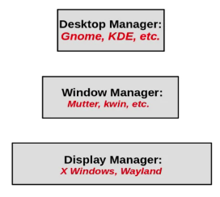

- **Display Manager**

    - **X Window**: também chamada de **X**, ou **Xorg**, foi designada a mostrar os resultados das atividades de computadores remotos, diferente de outros *OS* conhecidos, que mostravam apenas os programas rodando em máquinas locais, que poderiam, ou não, ter conexão remota. De maneira geral, a função principal do *X* é lidar com as informações advindas do teclado e mouse, mostrando os resultados dessas informações *inputadas* na tela, ou em várias delas.

        > Na nomenclatura do **X**, temos o **servidor** e o **cliente**. O primeiro é o que roda na máquina local e lida com *inputs* (teclado e mouse) e mostra os resultados na tela. Já o segundo, é a aplicação sendo mostrada na tela, podendo ser de um ambiente remoto ou local.

    - **Wayland**: substitudo do **X Window**

- **Window Manager**

    - Como vimos, **X** apresenta funções limitadas, não controla a posição exata e aparência das janelas na interface gráfica. Isso é trabalho do window manager, como também: lidar com múltiplos *desktops*, prover janelas tabuladas, controlar efeitos visuais.

    - Essa não é a lista completa de funções, e a fronteira do que o Display Manager, ou o Window Manager, faz não é bem definida. Além do mais, o próprio window manager tem a capacidade de muitas das suas propriedades, e diferentes window managers podem ser muito parecidos.

    - Para o Linux, existem alguns desses. Para GNOME 3 - **mutter**, KDE - **kwin**. Algumas alternativas são bem rápidas, ideais para *hardwares* limitados, como **fvwm** e **fluxbox**.

- **Desktop Manager**

    - É a camada mais superficial da interface gráfica do kernel Linux, é a que nós usuários interagimos. Suas funções são: gerar barras (menu, tarefas, ...), oferecer aplicações (relógio, monitor de performance, controle de volume, ...), habilita inicialização de aplicações na página inicial, modificar telas de fundo e temas, funções de *arrasta e solta*.

    - Os mais comuns são: Para GNOME - **gtk**, KDE - **QT**

    - Como mencionada a existência de window manager leves e rápidos, como **fvwm** e **fluxbox**, eles nem precisam de um desktop manager, uma vez que possuem funcionalidades suficientes para sobreviverem sozinhos.

**--help**

Á medida que avançamos, vamos usar mais o terminal, e uma *flag* muito interessante de se conhecer é a que te ajuda, te explica sobre determinado comando, e essa é a **--help**

```bash
comando --help
```

> retornará na tela pra que serve esse comando, e todas as suas flags

#### Módulo 2

**Trabalhando com editores de texto**

Editores de texto representam a maneira mais simples e direta de escrever *scripts*. Os mais conhecidos são:

- Vim

- Emacs

- nano

- gedit

E para começar, vamos aprender a gerar e escrever arquivos direto do terminal com os comandos **cat**, **echo** e **touch**, além dos sinais de redirecionamento **>**, **>>**.

- **touch**

```bash
touch nome_arquivo.extensão
```
> apenas cria o arquivo *nome_arquivo.extensão* no diretório atual

- **echo**

Funciona como a função print(), ou printf(). Se digitar no terminal o seguinte *script*:

```bash
echo hello world!
```

> retornará, no próprio terminal, a frase *hello world!*

Agora que entram os **sinais de redirecionamento**. Se digitarmos o seguinte *script*:

```bash
echo hello world > arquivo.sh
```

> A saída do comando *echo hello world* será escrita dentro do arquivo *arquivo.sh* . Caso ele não exista, o arquivo será criado no diretório atual

Agora, se quisermos adicionar uma linha ao *arquivo.sh*, não podemos mais usar o sinal **>**, pois essa linha nova **sobrescreverá** a já existente *echo hello world!*. Para solucionar esse problema, temos o sinal **>>**. Observe:

```bash
echo hello world again! >> arquivo.sh
```

> A saída do comando *echo hello world again!* será adicionada dentro do arquivo *arquivo.sh*, mas será abaixo da última linha do arquivo, como um *append*

- **cat**

Vem de *concatenar*. É um comando versátil que possibilita **leitura** e **escrita** num determinado arquivo, além de concatenar mais de um deles. Se fizermos o seguinte script:

```bash
cat arquivo.sh
```

> será mostrado no terminal o conteúdo do *arquivo.sh*

```bash
cat arquivo1.sh arquivo2.sh
```

> será mostrado no terminal o conteúdo do *arquivo1.sh* e *arquivo2.sh* de maneira concatenada

Agora, se usarmos um dos sinais de redirecionamento, o terminal dará a possibilidade de escrevermos várias linhas de uma vez:

```bash
cat sinal_redirecionamento arquivo.sh
```

> o terminal dará a possibilidade de escrever de maneira livre o que vai dentro do arquivo. Se usar um **>**, o que for escrito sobrescreverá o que já existe, se usar um **>>**, fará um *append*

Podemos combinar também adição de um arquivo em outro usando o cat. Observe:

```bash
cat arquivo1.extensão sinal redirecionamento arquivo2.extensão
```

> o que teremos é a saida de um arquivo sendo direcionada a outro, e dependendo do sinal de redirecionamento, será um sobrescrito ou *append*

**Alias**

Podemos colocar *apelidos* a determinados programas. Isso facilita quando digitamos com frequencia certos comandos de sintaxe grande. Podemos fazê-los em dois lugares:

- **terminal**

    o *apelido* só permanesce ativo enquanto o terminal estver aberto, se fechá-lo e abrir outro, já era

```bash
alias apelido=comando_atual
```

- **~/.bashrc**

    sempre que iniciamos um terminal novo, o arquivo *bashrc* é executado, isso porque ele é um arquivo de inidicalização do *shell*. E nele existem diversos comandos em *shell script* que configuram certas preferências do terminal. Então, se escrevermos os *apelidos* dentro desse arquivo, eles não deixarão de existir mais, mesmo iniciando outro terminal. Diante disso, basta escrever os *alias* da mesma maneira acima, mas dentro do *.bashrc* e salvar.

**Variáveis Ambiente**

Sempre que fazemos arquivos (arquivos eu falo *scripts* numa linguagem de programação) pode ser interessante que os tornemos um **executável**, igual os programas que baixamos no computador e damos dois-cliques para serem executados. E para tal, logo que criamos um determinado *script*, devemos colocá-lo num diretório que o executável possa encontrar, esse é o **AMBIENTE**. Agora, a variável é o que recebe esse valor, sendo ela chamada de **PATH**. Por isso que se chama **variável ambiente**: é uma variável que recebe um *caminho* como valor. Podemos ver as variáveis ambiente da seguinte maneira:

```bash
echo $PATH
```

> retornará todas as variáveis ambiente.

Repare que elas sempre possuem uma pasta *bin*. Isso porque, no arquivo *.bashrc*, sempre vem já escrito um *script* que automaticamente coloca toda pasta bin do sistema na variável ambiente. Então, para criar um novo diretório que seja ambiente de execução de um programa/código, basta criar uma pasta *bin* e colocar esse arquivo dentro dela, ou colocar o programa/código numa desses diretórios já existentes, ou ainda, adicionar um novo diretório à variável ambiente. Isso pode ser feito no terminal, ou dentro do *.bashrc* (já mencioneu a diferença). Então, se faz da seguinte maneira:

```bash
PATH=caminho:$PATH
```
> adiciona o *caminho* à variavel ambiente

Caso queira adicionar o diretório atual, basta fazer a seguinte modificação:

```bash
PATH=$PWD:$PATH
```

> adiciona o diretório atual ao *PATH*. Note que existe um *$* antes de *PWD* pois esse é uma variável que contem um *caminho*

Pode-se fazer uma variável ambiente funcionar pra apenas um executável

```bash
PATH=caminho:$PATH arquivo.extensão
```
> Agora, mesmo existindo mais de um executável nesse ambiente, só o *arquivo.extensão* terá acesso

**Pipes**

Vimos, com os sinais de redirecionamento, a possibilidade de direcionar a saída de um comando para um arquivo. Esse mesmo mecanismo pode ser usado para comando/comando. Ou seja, redirecionar a saída de um comando para outro comando, e faz-se isso com o sinal **|**:

```bash
comando1 | comando2 | comando3 ...
```

> o que o **comando1** gerar de *output* será usado como *input* do **comando2**, que será usado como *input* do comando3 e assim vai

É possível até combinar um *pipe* com os sinais de redirecionamento, e armazenar a informação num arquivo

```bash
comando1 | comando2 | comando3 ... sinal_redirecionamento arquivo.extensão
```

> a saída gerada pelo *pipe* vai ser redirecionada ao *arquivo.extensão*

**Sistema de Arquivos e FHS**

- Na tradição UNIX, todos sistemas de arquivos e partições estão localizadas dentro do diretório raiz **/**

- O *FHS-Filesystem Hierarchy Standard*, administrado pela The Linux Foundation, especifica e explica o propósito dos principais diretórios que precisam estar presentes no *OS*. Muitas *distros* respeitam esse sistema, mas quase sempre não ao pé da letra.

- Podemos ver, nas seguintes tabelas, o descritivo dos principais diretórios que um *OS* com kernel Linux deve ter:

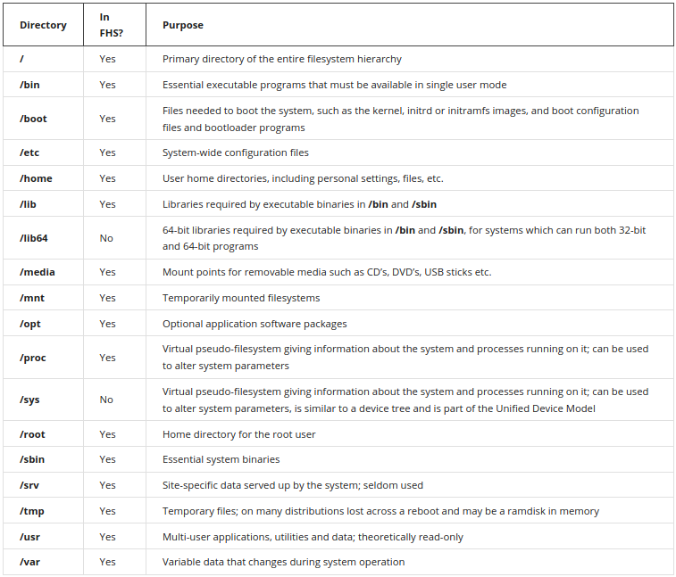 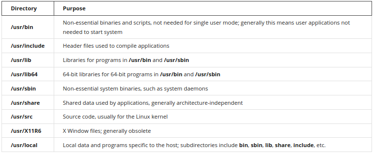 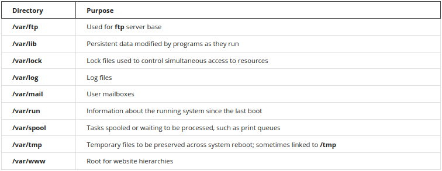

**Partições**

Falando agora do disco de armazenamento, ele é dividido em **partições**, sendo esse número limitado pelo tipo de disco. Um disco tipo SCSI pode ter 16 partições por exemplo. As informações das partições são armazenadas na *MBR - Master Boot Recorder*.

O kernel Linux descobre todos os discos ligados durante o momento de *boot* do sistema, sem a necessidade de arquivos préconfigurados para tal. Podemos ver as partições do disco com o seguinte shell script:

```bash
sudo /sbin/fdisk -l
```

> retorna as partições de disco

Perceba:

- Disco /dev/sda: tamanho -> isso é um disco

    - /dev/sda1 -> é uma partição do disco *sda*

Podemos modificar, criar ou excluir partições pelo terminal, ou de maneira gráfica com o **gparted**. É bem fácil e intuitivo

O esqueça com 3 partição é o mais simples e comumente usado, possuindo a seguinte disposição:

- /boot: de 100-200Mb, é onde fica o kernel do sistema e outros materiais relacionados sistema de *boot*. São arquivos vitais que raramente são modificados. É uma boa prática, e segura, manter essa partição saparada das demais.

- /: contém todo necessário, desde arquivos de programas, arquivos de usuários, a aplicações.

- swap: partição que funciona como *RAM*

**Tornando um arquivo executável**

Vimos que uma das etapas é configurar a variável ambiente que se encontra o arquivo. Agora, temos que torná-lo executável. Para isso, vamos entender as **permissões** dos programas, digite no seu diretório:

```bash
ll
```

> drwxrwxr-x

> -rw-rw-r--

Essas são algumas das combinações que podem aparecer.

- primeiro caractere:

    - d -> diretório

    - `-` -> arquivo

    - l -> link

- trio de caracteres:

    - r -> *readable* pode ser lido

    - w -> *writable* pode ser modificado

    - x -> *executable* pode ser executável

- ordem dos *trios*:

    - rwx------ diz respeito às permissões para **usuário**

    - ---rwx--- diz respeito às permissões para **grupo**

    - ------rwx diz respeiro às permissões para **todos**

Sabendo o significado das permissões, vamos modificá-las. Eu considero a maneira com números a mais fácil, e para aplicá-la, usamos o comando **chmod**:

```bash
chmod numero arquivo.extensão
```

Esse número é posui 3 caracteres, sendo cada um responsável pelas permissões de *usuário*, *grupo* e *todos*, e cada caracter corresponde à soma dos números da tabela abaixo:

r|w|x
:---:|:---:|:---:
4|2|1

Assim, se quisermos um arquivo com permissão **rwx** apenas para *usuário*, e **r** para *grupo* e *todos*

```bash
chmod 744 arquivo.extensão
```

#### Módulo 3

caso seja necessário algum dia, utilize o comando:

```bash
sudo systemctl start gdm
```

> inicia a interface gráfica do sistema operacional

**Etapas de inicialização**

- grub: permite a escolha do kernel, *distro*, partição que será inicializada

- /sbin/init: chamado de **init**, é o primeiro processo à nivel de usuário que roda no sistema, e continua até ser desligado. Ele coordena as últimas etapas de *boot*, configura o ambiente e inicia o processo de *login*

Para mostrar os estágios de inicialização, veja a tabela abaixo:

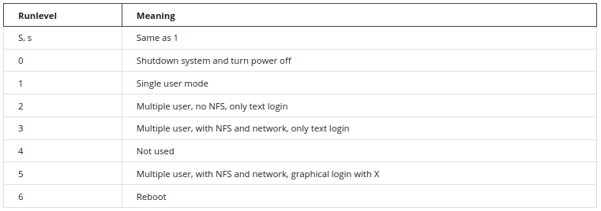

**Memória**

O kernel Linux usa o sistema de *virtual memory*, pois é maior que a memória física. É possível ver como a memória está distribuída através do terminal:

```bash
free -m
```

> retorna a distribuição da memória RAM em Gb

Para obter uma distribuição mais detalhada da memória, existe outro comando, que requer privilégios de *su*:

```bash
cat /proc/meminfo
```
> retorna um relatório mais elaborado da distribuição de memória

É possível limpar a memória *cache*, e uma das maneiras necessita que esteja em modo *su*. Feito isso, basta digitar o seguinte comando:

```bash
/proc/sys/vm/drop_caches
```

#### Módulo 4

Para consultar qual versão do Kernel, basta escrever o seguinte comando:

```bash
uname -r
```

> retorna a versão do kernel utilizada

#### Módulo 5

**Gerenciador de Pacotes**

Como eu uso uma *distro* baseada em Debian, vou escrever apenas sobre **dpkg** e **apt**

- **dpkg**: gerenciador de pacotes de *baixo nível*. Caso vc tenha um arquivo com extensão **.deb**, é possível gerenciá-lo com o *dpkg*.

- **apt**: também conhecido como *apt-get*, é outro gerenciador de pacotes de *distros* baseadas em Debian. Ele é *alto nível* e funciona à base de repositórios.

Para facilitar, os comandos mais usados podem ser listados na imagem abaixo:

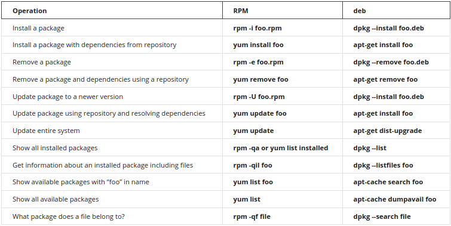

**Usuários Linux**

Todos usuários linux são associados a um ID único, sendo estes números inteiros, em que o primeiro usuário ganha o ID 1000, e o próximo 1001 e por aí vai. Pode-se ver através do comando:

```bash
sudo gedit /etc/passwd
```

> george:x:1000:1000:George Metesky:/home/george:/bin/bash

- *george* -> o nome do usuário

- *x* -> senha

- *1000* -> ID do usuário

- *1000* -> ID do Grupo Primário

- *George Metesky* -> nome completo do usuário, mas pode ser que apareça valores diferentes

- */home/george* -> diretório **HOME** do usuário

- */bin/bash* -> *shell* padrão do usuário, mas pode aparecer outro

Também é possível ver alguns outros *users* que não correspondem a usuários reais, mas são entidades importantes usadas por certas funções e programas.

Agora, quando se trata de um grupo, cada um deles também recebe um ID único.

```bash
sudo gedit /etc/group
```

> fuse:x:106:root, george

- *fuse* -> nome do grupo

- *x* -> senha

- *106* -> ID do grupo

- *root, george* -> usuários membros do grupo *fuse*

Podemos ver informações sobre usuário com o comando:

```bash
id
```

> uid=1000(george) gid=1000(george) groups=106(fuse),1000(george)

Podemos ver a que grupo um usuário pertence com o seguinte comando:

```bash
groups nome_usuario
```
> *nome_usuario*: grupos que *nome_usuario* pertence

**Grupos** são usados para estabelecer conjuntos de regras, privilégios e segurança aos usuários membros. O acesso a determinados diretórios e programas também é configurado através dos grupos.

**Adicionar e Remover Usuários e Grupos**

Para adicionar um novo usuário:

```bash
sudo useradd -p -m nome_usuario
```

> adiciona *nome_usuario*, dá a possibilidade de cadastro de senha e cria-se um HOME para ele

Caso não tenha usado *-p*, é possível criar uma senha para o novo usuário da seguinte maneira:

```bash
sudo passwd nome_usuario
```
> será solicitada introdução de cadastro de senha para *nome_usuario*

Para deletar um usuário:

```bash
sudo userdel -r nome_usuario
```

> deleta *nome_usuario* e o diretório HOME associado a ele

Para adicinar um novo grupo:

```bash
sudo groupadd nome_grupo
```

Para remover:

```bash
sudo groupdell nome_grupo
```

Pada adicionar um usuário a um grupo, temos:

```bash
sudo usermod -aG nome_grupo nome_usuario
```

Para remover um usuário de um grupo:

```bash
sudo usermod -G nome_grupo nome_usuario
```

> retira *nome_usuario* de *nome_grupo*

Por fim, para entrar na conta de outro usuário, basta usar o seguinte comando:

```bash
su nome_usuario
```
ou

```bash
ssh nome_usuario
```

> será solicitada a senha de *nome_usuario*

Quando feito, se olharmos o que tem dentro do HOME de *nome_usuario*, perceberemos que existirão alguns conhecidos nossos, como *.bashrc*, *.cache*, *bash_logout*, ... E, para sair, é só digitar:

```bash
exit
```

## Curso 3: Linux Tools for Developers
##### Professor: Jerry Cooperstein

##### Nesse curso, nos concentraremos em como usar as ferramentas Linux para tarefas diárias, tudo dentro das linhas de comando do Shell Script, além de passarmos por compiladores, como **gcc**.

### Anotações

#### Módulo 1

**Comandos Úteis**

Para trabalhar com desenvoltura pelo terminal, existem alguns comandos bem úteis, e eles são demostrados na imagem:

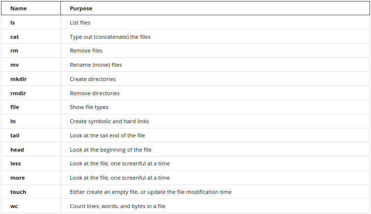

**ls**

```bash
ls path
```

> retorma uma lista de arquivos contidos no *path*

Temos também **la** e **ll**. O primeiro retorna até os arquivos escondidos, já o segundo retorna também as permissões de cada arquivo

**rm**

```bash
rm path/nome_arquivo.extensão
```

> exclui o arquivo *nome_arquivo.extensão*

**mv**

```bash
mv path/nome_arquivo.extensão novo_path/nome_arquivo.extensão
```

> move *path/nome_arquivo.extensão* para *novo_path/nome_arquivo.extensão*

Repare: se não modificar o *path*, mas modificar *nome_arquivo.extensão* somente, muda-se somente o nome do arquivo

**cp**

```bash
cp path/nome_arquivo.extensão novo_path/nome_arquivo.extensão
```

> copia *path/nome_arquivo.extensão* para *novo_path/nome_arquivo.extensão*

**mkdir**

```bash
mkdir path/nome_diretorio
```

> cria um diretório *nome_diretorio* no *path*

**rmdir ou rm -rf**

```bash
rmdir path/nome_diretorio
```

> exclui o diretório *nome_diretorio* do *path*

**file**

```bash
file path/arquivo.extensao
```

> mostra o tipo do *arquivo.extensao* no *path*

**grep**

```bash
grep "padrão" path/arquivo.extensão
```

> mostra as linhas do *arquivo.extensão*, no *path*, que contém o "padrão"

Esse comando vale a pena mostrar algumas de suas *options*

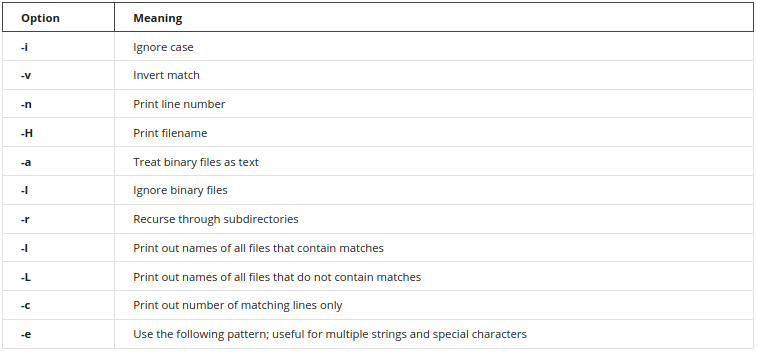

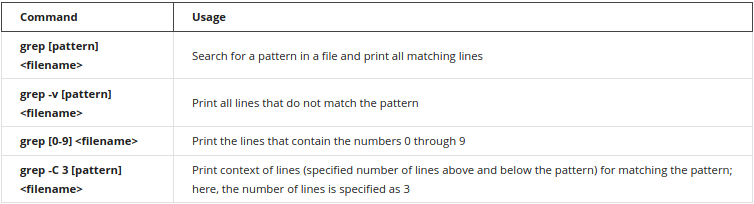

**string**

```bash
string arquivo.extensao | grep "padrao"
```

> retona um *standard output* das linhas do *arquivo.extensao* que contém o "padrao". A diferença é que o comando *string* funciona para extensões *non human-readable*, como uma planilha de excel por exemplo. Ela é fácil de ler quando dentro do excel, mas fora dele não é humanamente possível

**find**

```bash
find path -name "padrão"
```

> encontra arquivos no *path* com nomes que correspondem ao "padrão"

**sed**

Esse comando serve para **substituir** caracteres por outros dentro de um arquivo

```bash
sed s/"padrao 1"/"padrao 2"/g path/arquivo.extensao > path/novo_arquivo.extensao
```
- **s** -> substituir

- **"padrão 1"** -> padrão a ser substituído

- **"padrão 2"** -> padrão que vai substituir

- **g** -> global. Significa que haverá substituição todas as vezes que o "padrão 1" for encontrado. Caso não coloque o *g*, vai substituir apenas na primeira aparição.

Note:

```bash
sed -i 1,3s/"padrao 1"/"padrao 2"/g path/arquivo.extensao
```
- **-i** -> faz as substituiçoes no mesmo *arquivo.extensao*

- **1,3s** -> faz as devidas substituições apenas no *range* de linhas 1 a 3

Caso queira fazer substituições a mais de um padrão, temos:

```bash
sed -e s/"padrão 1"/"padrão 2"/g -e s/"padrão 3"/"padrão 4"/g path/arquivo.extensão > path/novo_arquivo.extensão
```

Creio que já foi possível perceber que o comando **sed** gera um *output*. Podemos usar **pipelines** que se relacionam com saídas de comandos também. Veja:

```bash
echo "oi mundo" | sed s/"oi"/"tchau"/g > path/arquivo.extensao
```

> escreve no arquivo *arquivo.extensao*, do *path*, o *output* do comando *echo* já com as devidas substituições

**tr**

Esse comando dá um passo além do **sed**, é possível fazer mais que só substituir um padrão por outro, podemos excluir também.

```bash
cat arquivo.extensao | tr option "padrao 1" "padrao 2"
```

> retorna um *standard output* de *arquivo.extensao* com as ocorrencias de *padrao 1* trocadas por *padrao 2*

Podemos ver mais formas de usar esse comando na seguinte imagem

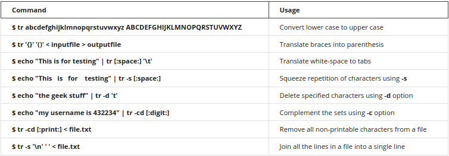

**Manipulando Arquivos de Texto**

<< *heredoc* serve como *sinal de parada* para introdução de textos. Exemplo:

```bash
cat > arquivo.extensao << EOF
```

> o comando *cat* para de receber *inputs* pelo terminal quando recebe uma linha escrito *EOF*. Isso significa *End of File*. É uma convenção, mas nao precisa ser *EOF* necessariamente, poderia ser *parada*, *STOP*, ...

**sort**

```bash
sort options arquivo.extensao
```
options:

- sem option

> retorna um *standard output* com as linhas em ordem de acordo com a primeira letra de cada linha

- **-k 3**

> retorna um *standard output* com as linhas ordenadas de acordo com o *terceiro* caracter de cada linha

- **-r**

> retorna um *standard output* com as linhas ordenadas de maneira inversa de acordo com o *primeiro* caractere de cada linha

- **-u**

> retorna um *standard output* ordenado já revisado se existem linhas duplicadas

**uniq**

```bash
uniq option arquivo.extensao
```
options

- sem option

> retorna somente os valores únicos de *arquivo.extensao*

- **-c**

> retorna a contagem do número de linhas diplicadas em *arquivo.extensao*

**paste**

```bash
paste option arquivo1 arquivo2
```

- sem option

> retorna um *standard output* com *arquivo1* e *arquivo2* combinados, não é um *append*

- **-d"delimitador"**

> retorna um *standard output* com *arquivo1* e *arquivo2* combinados, separados pelo *"delimitador"*

**join**

```bash
join -t"delimitador" arquivo1 arquivo2
```

> retorna um *standard output* que combina colunas usando *"delimitador"* como separador de colunas, mas sem repetir as duplicadas

**cut**

```bash
cut -d"delimitador" -f3 arquivo.extensao
```
> retorna a coluna 3 de *arquivo.extensao*, sendo que esse arquivo delimita as colunas com o *"delimitador"*

**Lidando com Arquivos de Texto GRANDES**

Como se sabe, todo arquivo executado é carregado na memória RAM do computador. Às vezes, pode ser que ele seja grande demais e o sistema trave ou fique lento. Diante disso, temos o comando **less**. Ele ajuda a carregar arquivos, mas de uma maneira rápida e leve, mais que um editor de texto pelo menos. Seu uso é simples:

```bash
less arquivo.extensao
```

> retorna o conteúdo de *arquivo.extensão*, mas sem carregá-lo totalmente

O comando **head** e **tail** servem, respectivamente, para ver o conteúdo inicial e final de um arquivo

```bash
head arquivo.extensao
```
> retorna as 10 primeiras linhas de *arquivo.extensao*

```bash
head -5 arquivo.extensao
```

> retorna as 5 primeiras linhas de *arquivo.extensao*

O **tail** funciona igual. Porém, ele tem uma *option* muito interessante:

```bash
tail -f arquivo.extensao
```

> faz a *standard output* gerar continuamente os últimos valores de *arquivo.extensao*

Podemos *cortar* arquivos grandes também com o comando **split**. Ele retornará diversos arquivos derivados com o mesmo número de linhas cada, ou quase o mesmo:

```bash
split arquivo.extensao
```

**Arquivos Comprimidos**

Para arquivos **comprimidos** temos uma listinha de comandos parecidos com o que já vimos:

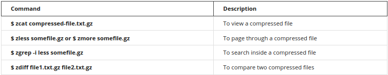

**Shell Script Básico**

Como padrão, um shell script tem o seguinte nome: **nome.sh**, sendo a sua extensão o que designa que esse programa é um shell script. Para executar um programa, não só um desse, mas qualquer um em geral, existem duas maneiras:

```bash
/usr/bin/bash arquivo.sh
```
> o interpretador *bash* vai executar o programa *arquivo.sh*

```bash
arquivo.sh
```

> para que esse execute, o *arquivo.sh* deve estar num diretório inserido no *$PATH*, ter permissão de *executável*, e ter na sua primeira linha o famoso **shebang** -> `#!/usr/bin/bash`. Ele serve para dizer onde está o interpretador para esse *arquivo.sh*. De maneira geral, isso tudo não funciona só para arquivos *.sh*, mas para qualquer programa que possua um executável

- Operadores Lógicos

OR|AND|EQUAL STRING|EQUAL EXPRESSION|DIFFERENT STRING|DIFFERENT EXPRESSION|IN|BIGGER|SMALLER|SMALLER OR EQUAL|BIGGER OR EQUAL
:---:|:---:|:---:|:---:|:---:|:---:|:---:|:---:|:---:|:---:|:---:
`||`|`&&`|`==`|`-eq`|`!=`|`-ne`|`=~`|`-gt`|`-lt`|`-le`|`-ge`

- Condicional com Arquivos


#### Módulo 2

**Tipos de Arquivos**

Como já mencionado, existem tipos diferentes de arquivos, e aqui vai uma tabela mais completa deles


mais uma vez, caso queira ver os tipos dos arquivos num diretório, basta usar o segunte comando:

```bash
ll
```

> mostra diversar informações sobre cada arquivo dentro do diretório, sendo os tipos de arquivos uma dessas informações, sendo o primeiro caracter antes dos *trios de permissões*

**Como trocar Proprietário e Grupo de um Arquivo**

Já vimos também como criar/excluir usuários e grupos, agora veremos como trocar essas informações em um arquivo.

Caso tenha percebido: **tudo no linux é um arquivo**. Essa máxima é quase certa, salvo algumas excessões como sempre. E todo arquivo, creio eu, tem um proprietário e grupo. Para modificá-los, basta:

- **proprietário**

```bash
chown proprietario arquivo
```

> O *arquivo* terá como proprietário o *proprietario*

- **grupo**

```bash
chgrp grupo arquivo
```

> O *arquivo* terá como grupo o *grupo*

É possível trocar os dois de uma só vez:

```bash
chown proprietario.grupo arquivo
```

ou

```bash
chown proprietario:grupo aarquivo
```

> Agora, o *arquivo* tem como proprietário *proprietário* e *grupo* como grupo

Por fim, é possível usar a *option* **-R** que significa **recursividade**. Ou seja, tudo que estiver dentro, hierarquicamente falando, do arquivo, receberá tais mudanças de grupo ou proprietário

```bash
chown -R proprietario.grupo .
```

> Tudo dentro do diretório atual terá *proprietário* e *grupo*

```bash
chown -R proprietario.grupo diretorio
```

> Tudo dentro do *diretorio* terá *proprietario* e *grupo*

Note: caso o usuário não seja proprietário, ou não pertença ao grupo do arquivo, só será possível trocar essas informações com **sudo**, desde que o usuário tenha permissão também.

**Arquivos de Sistema**

Para ver os arquivos de sistema:

```bash
df -h
```
## Curso 4: Using Git for Distributed Development
##### Professor: Jerry Cooperstein

##### Nesse curso, será apresentada uma introdução de como versionar projetos com **Git**.

### Anotações

#### Módulo 1

**Instalando o versionador Git**

Primeiro, deve-se instalar o **Git**. Então:

```bash
sudo apt install git
```

> Existem algumas *options* que podem ser passadas para instalar mais coisas, mas essa forma acima já atende muita coisa

**Comandos Básicos de Git**

```bash
git --version
```

> retorna a versão do git instalado

Para versionar um projeto, devemos iniciar o versionamento. E para tanto:

```bash
git init
```

> cria um diretório **.git** dentro do diretório do projeto. Assim, tudo que estiver dentro do diretório do projeto será versionado

Feito isso, devemos configurar os usuários do reposítório, e podemos fazer isso *globalmente* ou *para o projeto*

- global

```bash
git config --global user.name "nome"

git config --global user.email "email"
```

> todos os projetos versionados com git terão como proprietário *nome* e email *email*

- projeto

```bash
git config user.name "nome"

git config user.email "email"
```

> *nome" será responsável por esse único repositório

**Ciclo de Vida no Git**

Quando criamos/modificamos algum arquivo num diretório versionado, essa informação possui um *ciclo de vida*:

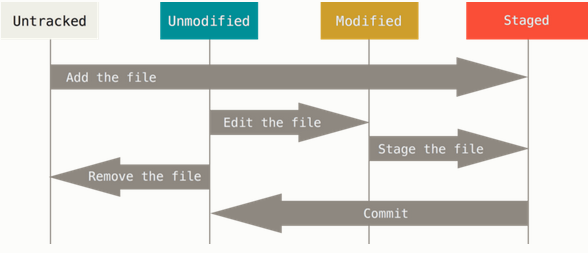

- Untracked: quando adicionamos um arquivo novo no diretório versionado, ele ainda não "foi visto" pelo git

- Unmodified: arquivo já monitorado pelo versionador local que não apresenta nenhuma modificação

- Modified: arquivo monitorado que foi mododificado

- Staged: arquivo pronto para ser *commitado*

Para entender melhor, podemos criar um arquivo dentro de um diretório versionado:

```bash
echo "Hello" > teste.txt
```

criado o arquivo *teste.txt*, podemos dar um:

```bash
git status
```

> mostrará o status do repositório local do projeto

Nesse caso, veremos que aparecerá uma mensagem dizendo que *teste.txt* está **untracked**, isso porque esse arquivo acabou de ser criado dentro do projeto. Para mudar esse status, devemos fazer o git rastrear esse arquivo. Então:

```bash
git add teste.txt
```

> foi dito ao git para **adicionar** *teste.txt* ao versionamento. Isso faz com que ele passe direto para o status de **staged**. E para modificar esse status:

```bash
git commit -m "mensagem explicativa sobre o commit"
```

> cria-se o primeiro nodo no grafo de commits. Agora, o *teste.txt* foi para o estágio de **unmodified**

Esse é o ciclo de vida mais simples de um arquivo. Podemos ver tanto os nodos quanto o grafo de commits usando o comando:

```bash
git log
```

> retorna os commits feitos, suas hashs, os textos explicativos, quem fez o commit e a que dia/hora, tudo isso numa espécie de **grafos**

Agora, caso seja feita alguma mudança nos arquivos monitorados, eles sempre sairão de **modified** para **staged**. Caso seja feita alguma mudança, sem levá-la para **staged**, podemos ver as mudanças feitas com o comando:

```bash
git diff
```

> retorna o que foi modificado no arquivo. O sinal de *+* representa o que foi acrescentado, já *-* o que foi retirado. Lembre-se: esse comando não mostra as modificações caso já tenha sido dado *add* no arquivo.

Sempre que queremos renomear ou excluir algum arquivo, usamos os comandos *mv* ou *rm*. Mas quando fazemos isso num diretório que está sendo versionado, podemos fazer com comandos git também:

```bash
git mv nome_antigo nome_novo
```

> Vai renomear o arquivo *nome_antigo* para *nome_novo*

```bash
git rm arquivo
```

> vai excluir tanto o arquivo quanto as informações sobre ele no versionamento

Lembre-se: para validar esses comandos *git mv* e *git rm*, deve-se *commitá-los*

#### Módulo 2

**Forking**

Quando disponibilizamos um programa/arquivo num repositório remoto, devemos escolher uma licença que respeite o que eu permito que seja feito com os códigos, bem como o projeto em si. Caso a licença permita que outros contribuam, é possível fazer um **fork**. Isso significa *copiar* o projeto num repositório próprio. Feito isso, é possível propor novas funcionalidades, corrigir bugs... Tudo isso sem que o projeto seja seu propriamente dito (se a licença permitir é possível também).

**Pull Request**

Quando fazemos um **fork** e modificamos algo, temos a possibilidade de propor ao proprietário do projeto que aceita tais mudanças, e para tanto, devemos fazer um **pull request**. Feito isso, o proprietário verá se a mudança implementada faz sentido, se fizer, ele pode incorporar tal mudança no projeto.

**.gitignore**

Como o próprio nome diz, é um arquivo que diz para o *git* **ignorar**. Pode ignorar um arquivo específico, podem ser vários, como uma extensão por exemplo:

```bash
cat > .gitignore << EOF

*.csv
!nomes.csv
EOF
```

> Aqui foi feito um *.gitignore* que diz ao versionador para ignorar todos os arquivos *.csv*, exceto *nomes.csv*

