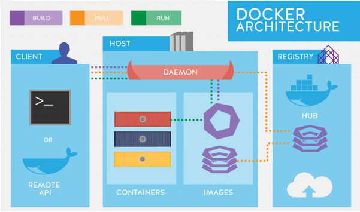

# **Docker Basico**
#### por Rudi Hind

## Curso introdutorio de Docker
#### Professor: Rudi Hind

## Anotacoes

### Aula 1

**Como baixar o Docker?**

0 - Caso esteja com preguiça:

```bash
$ sudo snap install docker
```

Agora, se não quiser fazer isso toda vez, basta seguir os passos abaixo

1 - Entre no site do [Docker](https://docs.docker.com/get-docker/)

2 - Escolha o SO

3 - Execute os comandos

```bash
$ sudo apt-get install \
    apt-transport-https \
    ca-certificates \
    curl \
    gnupg-agent \
    software-properties-common
```

```bash
$ curl -fsSL https://download.docker.com/linux/ubuntu/gpg | sudo apt-key add -
```

> perceba que aparecerá a seguinte chave 9DC8 5822 9FC7 DD38 854A  E2D8 8D81 803C 0EBF CD88. Os 2 últimos conjuntos serão úteis

```bash
$ sudo apt-key fingerprint 0EBFCD88
```

```bash
$ sudo add-apt-repository \
   "deb [arch=arm64] https://download.docker.com/linux/ubuntu \
   $(lsb_release -cs) \
   stable"
```

```bash
$ sudo apt-get install docker-ce docker-ce-cli containerd.io
```

```bash
$ sudo docker run hello-world
```

> se tudo deu certo, vai aparecer uma mensagem escrito isso

### Aula 2

**O que é Docker?**



- Client: quem requisita as coisas (comandos). No caso desse curso, digitaremos eles no terminal (CLI)

- Docker HOST: e o server padrao do *Client*. A *engine* do Docker fica na maquina mesmo, o que faz o Docker funcionar localmente, seja: rodar containers, criar imagens.

- Registry: esse e o server remoto (tipo GitHub). Aqui, podemos *pegar* imagens prontas (docker pull no CLI), podemos subir nossas imagens (docker push no CLI)

- Container: ambiente **isolado** onde rodam as imagens. E como se fosse uma maquina virtual muito enchuta, onde temos os principais componentes para rodar uma aplicaçao dentro do container

- Imagem: representaçao estatica de um aplicativo, ou serviço, bem como suas configuraçoes e dependencias

**Baixando uma imagem**

Usaremos nosso *client* (CLI) para mandar instruções ao **Host** e **Registry**

```bash
$ docker pull nome_imagem
```

> *nome_imagem* é a imagem que deseja rodar. Para esse curso, foi proposta a nginx

**Criando um container para a imagem baixada (docker run)**

```bash
$ docker run nome_imagem
```

> cria um container e roda *nome_imagem* dentro dele. Mas essa forma inutiliza a aba atual do terminal, pois passa a mostrar o server que roda o container

```bash
$ docker run nome_imagem:tag
```

> gera um container de *nome_imagem* da versão referente à *tag*. Para ver as versões disponíveis de uma imagem, entre no site

```bash
$ docker run -d nome_imagem
```

> cria um container e roda *nome_imagem* dentro dele sem inutilizar o terminal atual, pois faz o container rodar em segundo plano

```bash
$ docker run nome_imagem sleep tempo
```

> cria um container de *none_imagem* com ciclo de vida de *tempo* segundos

**Comandos básicos**

```bash
$ docker images
```

> mostra as imagens baixadas

```bash
$ docker ps
```

> veremos quais containers estão rodando

```bash
$ docker ps -a
```

> veremos quais containers estão rodando ou parados

```bash
$ docker start container_ID
```

> inicia o container *container_ID* já existente. E para tal, deve-se usar um *docker run nome_imagem* antes, pois aí iniciará um container para *nome_imagem*

```bash
$ docker stop container_ID
```

> para o container *container_ID* que está rodando

```bash
$ docker rm container_ID
```

> exclui o container *container_ID*. Para que dê certo, deve-se **parar a execução** dele com *docker stop container_ID*

```bash
$ docker rm -f container_ID
```

> exclui o container *container_ID* mesmo se ele estiver rodando

```bash
$ docker rm $(docker ps -a -q)
```

> exclui **todos** containeres de uma vez através de seus *container_IDs* devido a *flag* *-q*. Para que dê certo, deve-se **parar a execução** deles com *docker stop container_ID*

```bash
$ docker image rm image_ID
```

> exclui a imagem *image_ID*.Funciona também se colocar *REPOSITORY* no lugar de *IMAGE_ID*

```bash
$ docker image rm $(docker images -q)
```

> exclui **todas** imagens pelas suas *image_IDs*.

**Acesso ao container enquanto ele é executado**

```bash
$ docker exec container_ID comando
```

> executa *comando* dentro de *container_ID*. Se escolhessemos o comando *ls*, aparecia no CLI os diretórios de /

```bash
$ docker run -i nome_imagem
```

> cria um container de *nome imagem* de maneira **interativa**. Isso quer dizer que: caso a imagem necessite receber um *input* pelo terminal, ele será abilitado para receber o que a aplicação solicita

```bash
$ docker exec -ti container_ID sh
```

> executa o shell do *container_ID*. A flag *-ti* serve para atrelar o *standard io* do terminal do container com o terminal do host

**Exposição de portas**

Se a imagem não tiver em sua construção uma porta exposta, tentar esse comando não funciona. Para ver isso, basta usar *docker run*, depois *docker ps* e ver a coluna **PORTS**, se tiver um número, é sinal que existe porta exposta

```bash
$ docker run -d -p HOST_PORT:CONTAINER_PORT nome_imagem
```

> cria um container e o inicia para a imagem *nome_imagem*, sendo que esse container tem a porta *CONTAINER_PORT* conectada com a porta *CONTAINER_HOST* do host

Caso a aplicação que rode dentro do container tenha algo para mostrar numa porta, é só entrar no browser e digitar a porta exposta do *HOST*

```php
localhost:HOST_PORT
```

**Mudança do nome de um container**

```bash
$ docker run -d --name nome nome_imagem
```

> container terá o nome *nome* listado na coluna *NAMES* de *docker ps*

Agora, escreve-se *nome* do container invés de *CONTAINER_ID*

**Criação de ambientes de desenvolvimento com Docker Volumes**

É importante saber esse conceito para **ligar** arquivos do *Host* com os **dentro** do container, pois sabemos que, uma vez destruído o container, tudo lá dentro é destruído também. Pode ser também que necessitemos mudar algum arquivo que roda no container, e se ele não estiver ligado fora do ambiente isolado, sempre teremos que criar uma imagem nova cada vez que esse arquivo muda.

```bash
$ docker run -d nome_imagem
```

> temos que criar um container para a imagem desejada

```bash
$ docker exec -ti container_ID bash
```

> temos que executar e *linkar* o terminal do *container_ID* com o terminal do host

```bash
# touch diretorio/arquivo
# echo "oi mundo" > diretorio/arquivo
# exit
```

> criado, dentro do container, o arquivo *~/teste/arquivo.txt*

Como podemos perceber, não apareceu nenhuma pasta com o arquivo *~/teste/arquivo.txt* na *HOME*

Agora, **vamos *linkar* um volume ao container**

```bash
$ docker run -d -v HOST_path:/CONTAINER_path imagem_ID
```

- HOST_path: caminho no **HOST** do diretório que vamos ligar

- CONTAINER_path: caminho no **CONTAINER** do diretório que vamos ligar

> cria um container da *imagem_ID* com o diretório *HOST_path* e *CONTAINER_path* ligados

```bash
$ docker exec -ti container_ID bash
# ls CONTAINER_path
```

> mostrará os arquivos de *HOST_path* dentro de *CONTAINER_path*, já que eles estão ligados agora

Se criarmos, ou modificarmos algum arquivo **dentro** de *CONTAINER_path*, eles aparecerão em *HOST_path*. Se fizermos o contrário, também vai dar certo devido ao *link* entre os diretórios

**Produção do Website dentro do conteiner**

Vá para o diretório da aplicação web

Agora, vamos *linkar* esse diretório com algum do container

```bash
$ docker run -d -p 8000:80 --name site -v $(pwd):/usr/share/nginx/html nginx
```

> roda um container da imagem *nginx*. Como já tinha-se mudado para o diretório da aplicação, bastou passar o diretório do *HOST* como $(pwd)

```bash
$ docker exec -ti site bash
```

> liga os terminais do container com o do HOST

```bash
# ls /usr/share/nginx/html
```

> mostrará os mesmos arquivos presentes no diretório da aplicação no HOST

Visto que os arquivos estão presentes, vá no browser e acesse a porta ligada ao container

```php
localhost:8000
```

> a aplicaçao estará rodando

**Nota**: caso a aplicação não rode:

```bash
$ chmod 766 APP_path
```

> será dada permissão de execução ao diretório da aplicação

**Inspecionar um container**

```bash
$ docker inspect container_ID
```

> retorna informações detalhadas sobre o *container_ID* no formato *.json*

**Criando as próprias IMAGENS**

A criação de uma **imagem** é feita como uma *receita* chamada **Dockerfile**. Esse tipo de arquivo tem o mesmo propósito de um *Makefile*: é uma sequencia de instruções. Nesse caso, é uma que o docker entende. Basicamente, é um arquivo com **instruções** e **argumentos**:

- Instruções:

    **FROM**: define qual imagem/OS será usado. **Toda** imagem é baseada em outra imagem já existente, e **todo** *Dockerfile* deve iniciar com a instrução **FROM**

    **WORKDIR**: funciona como a união dos comandos *mkdir* e *cd* do *bash*

    ```Dockerfile
    WORKDIR /diretorio_container
    ```
    > cria *diretorio_container* dentro do container e entra dentro desse container

    **RUN**: diz ao Docker para rodar um determinado comando no OS da imagem base

    **COPY**: copia arquivos **locais** para dentro da imagem

    ```Dockerfile
    COPY diretorio_local diretorio_imagem
    ```
    > *diretorio_local* é aonde está a aplicação localmente e *diretorio_imagem* é o diretório que guardará a aplicação na imagem

    **ENTRYPOINT**: permite especificar um comando que será executado quando a **imagem rodar num container**

    **CMD**: define o **programa**, ou **instrução**, que rodará dentro do container quando ele for iniciado
    
- Build da imagem:

    ```bash
    $ docker build diretorio_Dockerfile -t nome_imagem:versao
    ```
    > constrói uma imagem de acordo com o Dockerfile dentro de *diretorio_Dockerfile* com REPOSITORY *nome_imagem* e TAG *versao*

